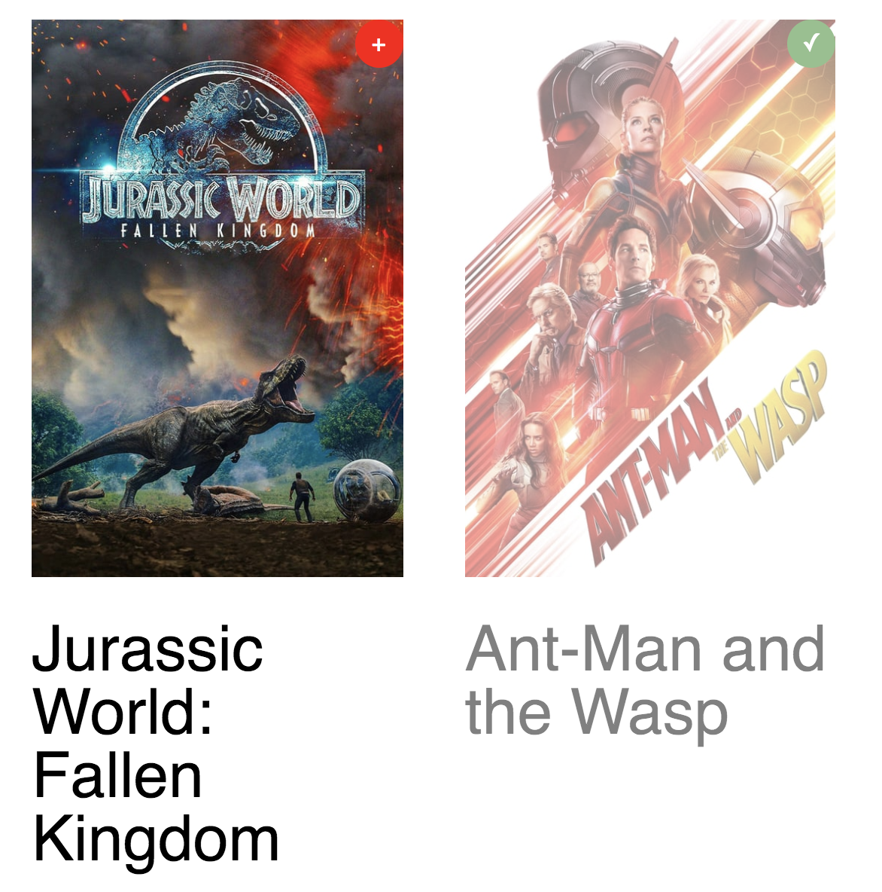
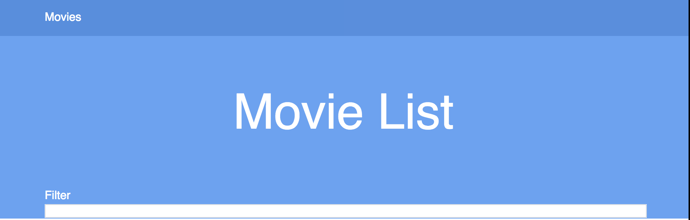

# web-design

[Bekijk de website hier](https://moniac.github.io/web-design/opdracht1/index.html)

## General

Het idee van de website is dat iemand een film kan toevoegen aan een 'kijk later' lijst.

De core functionality in dit geval is het kunnen klikken en tonen van een lijstje.

## Verkregen feedback

### Viktor

1.  Het is onduidelijk wat ik hier kan doen op de pagina

2.  Waarom is er geen titel?

3. Wellicht een animatie op de plus button?

### Rick

1. Waarom is er geen titel?

2. Ik kan het menu niet sluiten? (Oeps)

## Aanpassingen

De button wordt nu groen en een checkmark als je er op klikt, en de achtergrond wordt transparant. Hierdoor is het wat duidelijker dat hier al op geklikt is.

---

De label komt nu na een kleine delay naar beneden in plaats van onmiddelijk.

---

Er is nu een titel toegevoegd

---

## Principes

### Provide a natural next step

Zodra je op het plusje klikt, komt er een label naar beneden wat de volgende stap is.

### Clarity is job

De website is echt extreem simpel in opzet, je ziet vrijwel meteen wat je kan doen.

### Keep secondary actions secondary

De label komt alleen in beeld wanneer een eerste actie is ondernomen. 