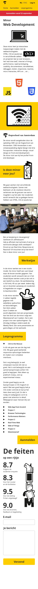
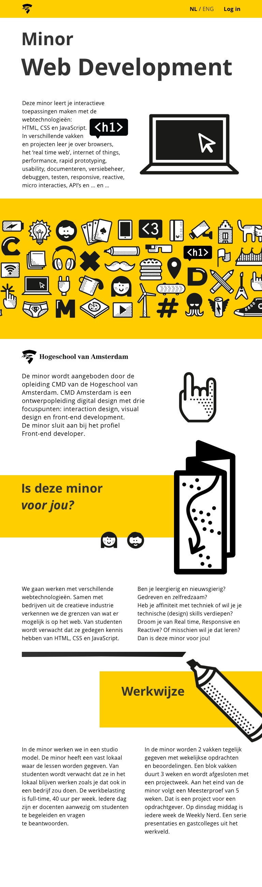

# Opdracht 2

# Introduction

This is a project where the website that I am making will be geared towards people who want to apply for a minor. One of the people I am designing for is deaf and will be giving me pointers on how to make my website more accessible.

## Table of Content

*   
*   

---

## User scenario's

Friend - ICT student
I want to be able to get a good impression of the minor and sign up for it.

Marie - Graphic Designer - Deaf

I want the website to be to the point and to get my job done (sign up for the minor).

---

## Breaking it down

It's not a secret that most websites and designs employ a lot of 'visual' noise. Empty/white space gets filled up by either text or graphics.

This means that for my product I will have to find a balance between just enough and too much text.

---

## User Interface Principles

This section will detail the principles I have tried to incorporate into my design.

1.  Clarity is job #1

    The website should immediately convey what it is and what it's for. \

2.  Consistency matters

    Incorporate the same paddings and margins everywhere, so everything is visually coherent. \

3.  Strong visual hierarchies work best

    Working with large font sizes, you can help guide the reader to what is important. \

---

## A first design

The mobile design

The tablet design

