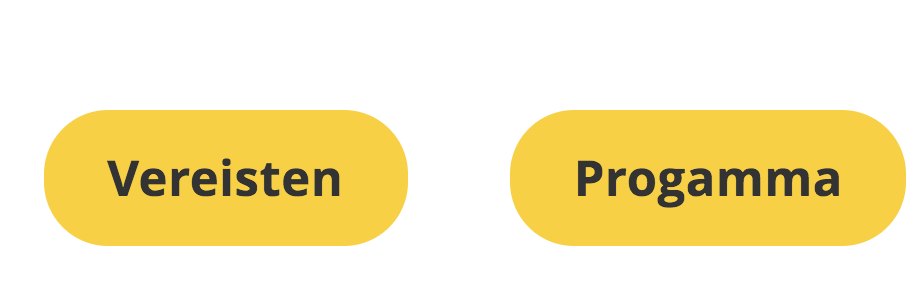
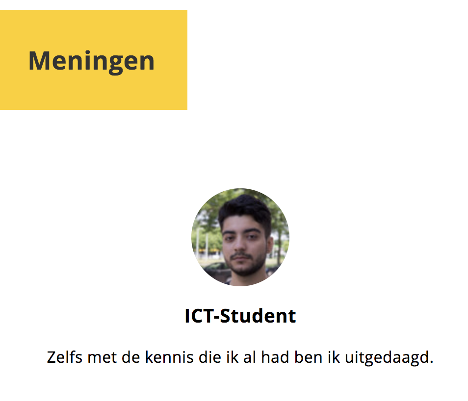
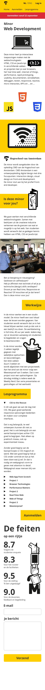
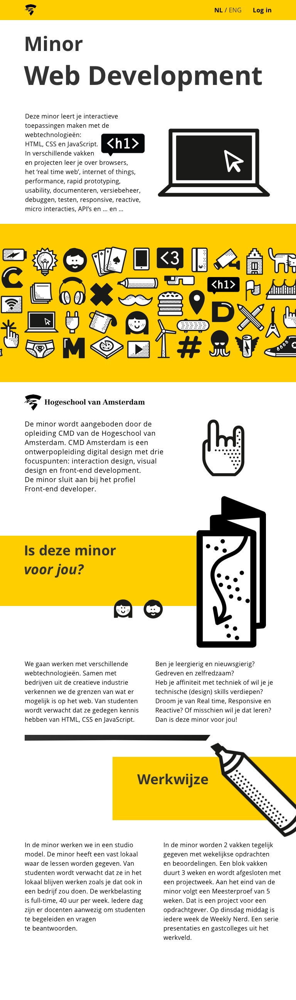
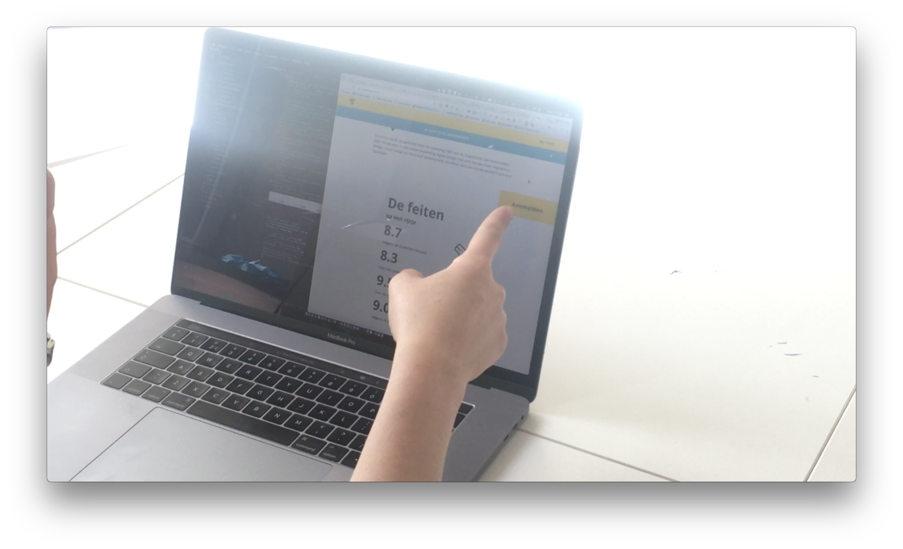
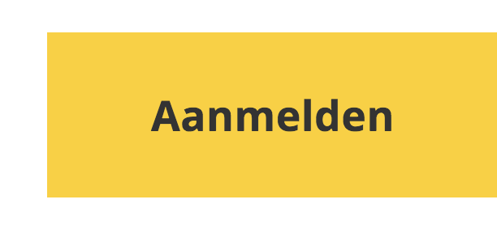

# Opdracht 2

[View the website](https://moniac.github.io/web-design/opdracht2/dist/index.html)

# Introduction

This is a project where the website that I am making will be geared towards people who want to apply for a minor. One of the people I am designing for is deaf and will be giving me pointers on how to make my website more accessible.

## Table of Contents

*   [User Scenario's](#user-scenario)
*   [Breaking it down](#breaking-it-down)
*   [User Interface Principles](#user-interface-principles)
*   [A first design](#a-first-design)

---

## Herkansing

De website was duidelijk te karig, mijn strategie om weinig content te gebruiken was uiteindelijk te extreem. Interessant genoeg vond Marie het juist gewoon goed, maar voor mijn andere gebruiker was het eenmaal niet zo.

Na overleg met mijn leraar Koop heb ik besloten om meer content toe te voegen en dit ook in stukken op te delen.

Hieronder volgen de stappen die ik heb gemaakt oms het design beter te maken.

* Navigatie toegevoegd aan de onderkant

Per pagina zijn er twee Navigatie knoppen toegevoegd aan de onderkant, hiermee wordt een suggestie geboden van waar de gebruiker als volgende naar toe kan.

---

* Betere tone of voice

De tone of voice is anders nu, in plaats van erg informeel is het een stuk directer nu. Er wordt gebruik gemaakt van 'Jij' en 'Je', zodat de bezoeker het idee heeft dat het om hem of haar gaat.

---

* De pagina is meer opgedeeld in stukjes content nu

---

* Vereisten pagina toegevoegd

Op deze pagina kunnen mensen zien welke benodigdheden aangeraden worden voor de minor, terwijl nieuwe en ervaren mensen het niveau goed kunnen inschatten aan de hand van wat code voorbeelden.

Hiermee laten we ook zien dat de code up to date is met de laatste standaarden.

---

* Review blok toegevoegd

Hier kunnen bezoekers de meningen van anderen zien, en kan je kort zien waar de studenten vandaan komen. In dit voorbeeld is 1 van de bezoekers een ICT student, en nu ziet ie ook een review van een mede ICT student.

---

* Programma pagina toegevoegd

Op deze pagina kunnen bezoekers kort lezen en zien welke vakken er van pas komen bij de minor. Hiermee zien ze wat de minor biedt.

---

* Contact pagina toegevoegd

Op deze pagina kunnen de mensen wat algemene informatie lezen wanneer ze hun keuze weten. Ze kunnen mailen naar een e-mailadres of het formulier gebruiken. Het formulier spuugt confettie uit na het invullen, als kleine verassing.s

---

## User scenario's

**Friend Govand - ICT student**

I am a second year ICT student and want to know if the minor Web Development is relevant and challenging for me.

### User needs

* What is the minor?
* What is to be expected of me?
* What will be the subjects?
* What do they teach me?

For an ICT student, it's important to know if a course will challenge them or not, ICT students already have some programming experience and it would be a waste of time to start from the very basics.

**Marie - Graphic Designer - Deaf**

I want the website to be to the point and to get my job done (sign up for the minor).

### User needs

Marie just wants to get her job done without too many complications, she enjoys it if a website is structured properly.

* How can I navigate through?
* What is the least bit of informationt that I need to do my job?

---

## The challenge

It's not a secret that most websites and designs employ a lot of 'visual' noise. Empty/white space gets filled up by either text or graphics.

This means that for my product I will have to find a balance between just enough and too much text.

How do you communicate enough information that someone understands what it is that you offer but without communicating too much?

---

## User Interface Principles

This section will detail the principles I have tried to incorporate into my design.

1.  **Clarity is job #1**

    The website should immediately convey what it is and what it's for.
    This is a very important principle in the case of Marie, where she doesn't want too much clutter.

2.  **Consistency matters**

    Incorporate the same paddings and margins everywhere, so everything is visually coherent.

3.  **Strong visual hierarchies work best**

    Working with large font sizes, you can help guide the reader to what is important.

4.  **One Primary action per screen**

    All of the pages have at most one action, which is either to navigate through or get some more content.

---

## A first design

The mobile design

This design is focused on getting the information as soon as possible.

The tablet design

This design offers more fun elements.

---

## Testing

Testing with Marie

[Watch the test video with Marie](https://youtu.be/36T3NtQpVuw)

Marie initally clicked on this yellow marker, which was intended as a title but looked too much like a button!

A solution would be to make it more obvious that this is just a title.

Testing with Govand

* Design is nice
* It's really straight to the point
* I don't know what is to be expected of me
* I don't know what I will learn
* Titles look clickable when they aren't

